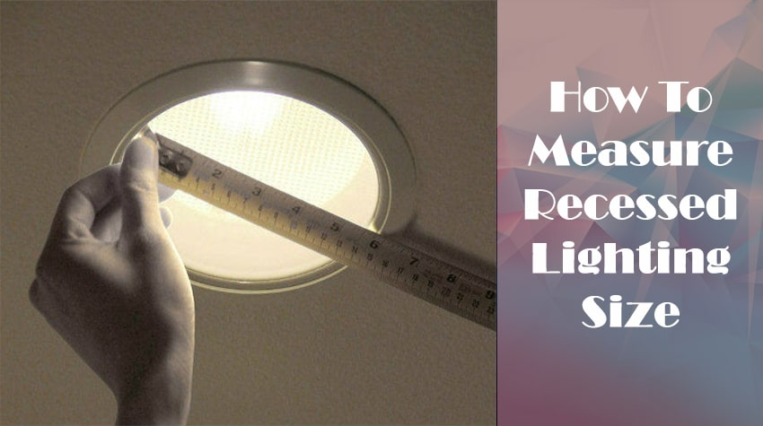
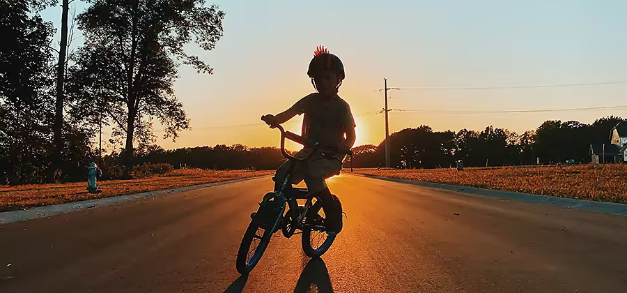

# Blender Lighting Tutorial

## Lighting plays a crucial role in enhancing the visual appeal and engagement of your scenes. It can make the difference between a lackluster result and a captivating one. However, one common issue is that many tutorials provide specific lighting setups like the three-point lighting technique.
----------------------
### In this tutorial, I will cover everything you need to know about lighting and how to handle various situations in your scenes. There are five key elements to consider for achieving good lighting:

#### 1. **Direction**: Understand how the direction of light influences the mood and appearance of your scene.

#### 2. **Size**: Explore the impact of light source size on shadows, highlights, and overall aesthetics.

#### 3. **Color**: Learn how to effectively use different colors of light to create atmosphere and evoke emotions.

#### 4. **Readability**: Ensure that your lighting setup allows the viewer to clearly perceive and understand the elements in your scene.

#### 5. **Emphasis**: Utilize lighting techniques to draw attention to specific objects or areas, creating focal points and guiding the viewer's gaze.

### By mastering these elements, you'll be able to create visually captivating and engaging renders in Blender. Let's dive into the fascinating world of lighting and uncover the secrets to achieving stunning results!

----------------------------

# COOMING SOOOOOOOOOOOOON 🔥🔥🔥
----------------------------